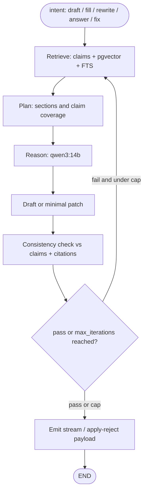
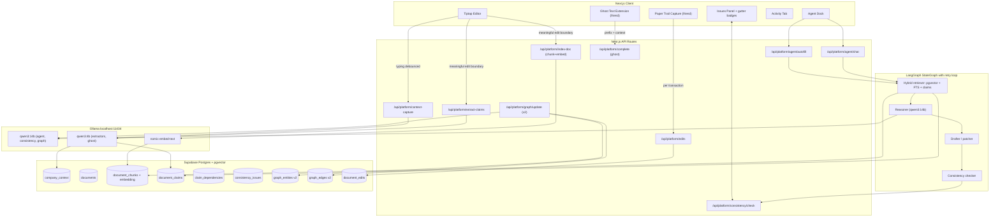

# Rontzen - Comprehensive Build Plan (v2, refined)


Local-first business-document OS for Series A/B teams. You type your company into existence, a Cursor-style **agentic** agent drafts every doc tailored to that context: **RAG is wrapped in LangGraph** so the model can **iterate** (re-retrieve, revise, re-check consistency) instead of a single linear `retrieve-then-generate` call. Cross-doc intelligence (RAG now, GraphRAG later) keeps numbers and narrative honest across files; every edit is attributed and timestamped. Nothing has to leave the machine unless the user opts in.


---


## 1. Division of labor (updated)


- **You** -  Agent + cross-document intelligence. That means: LangChain + LangGraph orchestration, Ollama helper, RAG pipeline (and later GraphRAG), context capture, claim graph, consistency engine (number + narrative), agent API routes, Agent Dock, Issues UI, schema for claims / flags / graph / chunks.
- **Friend** - Shadow / ghost-text completions **and** the **paper trail capture mechanism** (not hardcoded): Tiptap integration that emits per-edit events with `source`, `actor`, `rationale` metadata into `document_edits` on every meaningful transaction, plus the shadow-text extension that uses your context provider.
- **Shared contracts (both sides read):**
 - `CompanyContext` object (you write, he reads).
 - `document_edits` table schema + editor meta conventions (he writes, you read for the Activity UI).
 - `DocumentClaim` list for the current doc (you write, he reads for better completions).
 - `/api/platform/complete` endpoint (you own, he consumes).


Coordination is tiny: one shared `lib/platform/types.ts` + one `RontzenAgentContext` React context + one meta-keys cheat sheet.


---


## 2. Product one-liner


> "A local workspace where your company types itself into a pitch, a financial model, a board memo, and a playbook - all in sync, all auditable, and nothing leaves your laptop unless you say so."


Three pillars to pitch:


1. **Type-to-onboard.** No forms. Tell the workspace about your company in prose; the agent extracts structure live.
2. **Cross-doc intelligence.** Change ARR in the sales doc, dependent numbers and narrative in the financial memo, board update, and one-pager are flagged; agent proposes patches with apply/reject.
3. **Paper trail by default.** Every edit has actor, timestamp (UTC stored, local time displayed with timezone), source (user / ghost / agent / cross-doc), action, and optional "why".


---


## 3. Model + inference (honest pick)


**Primary (ships today):**


- **`qwen3:14b`** via Ollama. Best native function-calling + structured output at this size, ~9GB, 30-60 tok/s on M-series. Thinking mode on for consistency analysis and full-doc drafting; off for fast autofill.
- **`qwen3:4b`** for extractors (context capture, claim extraction, ghost completions). Keeps typing-to-onboard and ghost text sub-second.
- **`nomic-embed-text`** for embeddings (RAG + GraphRAG later).
- **Structured outputs** via Ollama's native `format: <json-schema>` param - deterministic, fewer retries, no regex hacks.


**Fallback chain in `lib/platform/ollama.ts`:** `qwen3:14b -> qwen3:8b -> qwen3:4b` if a model isn't pulled. Log which model served the request.


**Kimi K2 Thinking (try-later comment).** Full GGUF is ~245GB (1-bit Unsloth quant) and needs ~247GB RAM+VRAM for 1-2 tok/s - not viable on a hackathon laptop. `kimi-k2-thinking:cloud` on Ollama is a cloud passthrough, which breaks the "nothing leaves the machine" story. Treat Kimi K2 as a **post-hackathon experiment** behind a feature flag (`MODEL_PROVIDER=moonshot-cloud`) for users who opt in on a beefy machine or accept cloud.


---


## 4. Retrieval strategy: RAG now, GraphRAG later


Order: **RAG v1 -> evaluate -> GraphRAG / light graph v2** (only if narrative-level inference needs it).


### 4.1 RAG v1 (required for hackathon)


- **Framework:** **LangChain** for loaders / splitters / embeddings / retrievers. **LangGraph** for the **agent runtime** (required for this product): a `StateGraph` with **cycles** so the agent can loop **retrieve -> plan -> draft -> consistency check -> (retry or emit)** until outputs pass gates or `max_iterations` is hit. That is what makes RAG **agentic** (multi-step, self-correcting) rather than one-shot completion. Same graph pattern powers chat Q&A with optional re-query when citations are weak.
- **Store:** `document_chunks (id, user_id, doc_id, chunk_index, text, embedding vector, metadata jsonb, created_at)` with `pgvector` in Supabase. Metadata holds `doc_type`, `section`, `fiscal_period` when known.
- **Hybrid retrieval:** combine dense (`pgvector`) with Postgres FTS on the same `text` column (tsvector + GIN index). Critical for finance-flavored queries that name exact figures or terms (e.g. `"$2.1M ARR"`, `"Rule of 40"`).
- **Chunking:** paragraph / heading-aware, ~500-800 tokens, 80-token overlap. Use LangChain's `RecursiveCharacterTextSplitter` seeded with Markdown/HTML separators.
- **Re-indexing rule:** only chunks whose text hash changed get re-embedded (see section 6.2 Meaningful edit boundaries).
- **Tenant isolation:** every retrieval call must filter `WHERE user_id = $current_user`. Non-negotiable. RLS enforces it if app code forgets.


### 4.2 GraphRAG v2 (stretch; only if time permits)


- Stored **entirely in Postgres** next to the rest of the app: `graph_entities`, `graph_edges` tables (no separate graph DB).
- **Incremental**, not full-rebuild: on save, map changed paragraph ranges -> affected chunk ids -> re-extract only those chunks' entities/relations via `qwen3:14b` structured output -> upsert into `graph_entities/graph_edges` keyed on `(user_id, canonical_name)`.
- **Used for narrative (story-level) inference** like "ICP conflicts across docs", "positioning contradicts competitive section", "timeline commitments disagree". Not for metric sync - that's the claim graph.
- **Not shown in the UI as a node-edge graph.** Under-the-hood mechanism only; surfaces as plain-English issues in the Issues panel.


### 4.3 Numeric truth: NOT in the vector store


Hard rule: exact ARR / burn / headcount lives in `document_claims` (SQL), never "nearest-neighbor to the embedding of `$2.1M`". Vectors are for narrative context only.


---


## 5. Vector DB decision (with Pinecone on the menu)


**Default: Supabase Postgres + `pgvector` + Postgres FTS.** One DB, one auth model, one security story, graph tables live next door, no sync. Best starting point for Level 1 production.


**If retrieval load or hybrid requirements grow, swap the index tier without changing the rest:**


| Store | When to use it | Trade-off |
|---|---|---|
| **`pgvector` in Supabase** | Default. Small/medium corpora. One DB, RLS, simple. | Performance flattens at very large scale; ANN tuning is on you. |
| **Pinecone** | You know it, want a managed vector service with mature DX and LangChain wiring. | Extra vendor, extra API key, must enforce tenant filter on every query, must sync deletes. |
| **Turbopuffer** | Hybrid vector + full-text in one product; cost-sensitive at scale; serverless / object-storage economics. | Newer platform; second system alongside Supabase. |


**For this app:** start on `pgvector`; keep a `lib/platform/retriever.ts` interface so Pinecone or Turbopuffer is a drop-in swap later. Supabase remains source of truth for docs, claims, graph, edits, and auth regardless of which vector store wins.


**Why not "Turbopuffer instead of Supabase":** Turbopuffer is a search index, not an app DB. It doesn't replace Postgres / Auth / RLS / Storage. Same for Pinecone.


---


## 6. Cross-document intelligence (your moat)


Two layers, both needed:


### 6.1 Number-level (claim graph)


- Canonical keys locked for v1: `arr_usd`, `mrr_usd`, `monthly_burn_usd`, `runway_months`, `gross_margin_pct`, `cac_usd`, `ltv_usd`, `team_size`, `customers`, `new_mrr_per_month_usd`, `momentum_growth_pct`, `nrr_pct`, `tam_usd`, `sam_usd`, `som_usd`, `cash_on_hand_usd`.
- Deterministic hard-conflict checker (tolerance per key: exact for headcount, ±2% for revenue).
- Soft-implication checker via `qwen3:14b` with thinking mode for stale dependencies ("ARR changed but runway narrative in Board Memo still reflects old ARR").
- Derivation rules in `lib/platform/claimRules.ts` (e.g. `runway_months = cash_on_hand_usd / monthly_burn_usd`).


### 6.2 Story / narrative-level (RAG now; graph-assisted later)


- Structured "story fields" extracted per doc on meaningful save: `icp`, `stage`, `motion`, `primary_geography`, `timeline_commitments`, `risk_posture`, `product_scope`.
- Cross-doc comparison: deterministic keyword/rule checks + one LLM judge pass over retrieved snippets.
- Examples this catches: ICP story drift (enterprise vs mid-market), positioning vs competitive section, timeline commitment conflicts, product-naming drift, risk-language vs growth-language mismatch.
- GraphRAG upgrade path (section 4.2) makes this richer by linking entities/relations across many long docs, without changing the UI.


### 6.3 Meaningful edit boundaries (not per keystroke)


Heavy work fires on **edit boundaries**, not on every character:


- **Debounced save** (2-5s after last keystroke) **or** explicit save **or** tab blur.
- **Size gate:** skip if diff < N characters/words (typing your name).
- **Claim gate:** only run cross-doc checks if extracted claims actually changed.
- **Section gate:** skip checks for section types that don't host claims (e.g. freeform notes).
- **Incremental re-index:** only changed paragraph ranges go through chunking / embedding / graph update.


Between runs, UI shows a subtle "Analysis pending..." chip so users don't expect real-time flags.


### 6.4 UI surfacing (no graphs in the UI)


Treat cross-doc like an IDE treats compiler problems:


- **Doc list badges:** small dot or count on any doc with open issues (like file-tree error indicators).
- **Editor gutter / margin strip:** Tiptap decorations on affected ranges (squiggle analog), hover = one-line explanation.
- **Problems tray:** collapsible strip at bottom or right, "Issues (3)" in header, click a row -> scrolls to range.
- **Optional in-editor banner** at top of an affected doc when its peer changed: "Sales doc updated - ICP narrative may conflict here." [Review] [Dismiss]
- **"Apply fix" action** per issue: agent generates a patch as a **tracked insertion** (Cursor-style), user accepts/rejects per doc.


Data structure powering it: `consistency_issues (id, user_id, severity, type metric|narrative, summary, source_doc_id, target_doc_id, details jsonb, status open|dismissed|resolved, created_at)`. The "graph" stays invisible; users see titles, subtitles, badges, and diffs.


---


## 7. The Agent (Cursor for docs)


### LangGraph is required (not optional)


**Decision:** use **LangGraph** for all agent paths that need **iteration** (draft, section fill, rewrite, cross-doc fix, grounded chat). Hand-rolled `while` loops in API routes are explicitly out of scope for the agent layer — LangGraph gives:


- **Cycles** — conditional edges back to `retrieve` or `draft` when consistency fails or the model requests more context.
- **Shared state** — one `AgentState` object (messages, retrieved chunks, draft text, claim snapshot, iteration count, open issues) across steps.
- **Termination** — `max_iterations` and explicit `END` when checks pass or user-facing partial is emitted.
- **Future-proofing** — checkpointing, human-in-the-loop interrupts (e.g. pause before applying a multi-doc patch), parallel branches if you add tool nodes later.


**LangChain** remains the toolkit for documents, embeddings, and the retriever; **LangGraph** owns control flow. Ghost-text (`/api/platform/complete`) stays a **single-node** fast path without a graph.


Built around a LangGraph `StateGraph`:





### Capabilities


1. **Full-doc autofill** - pick a Core 5 doc + Draft -> streams Markdown into Tiptap grounded in `CompanyContext` + other docs' claims + retrieved snippets.
2. **Section autofill** - `/fill` slash-command or toolbar button on an empty heading; scoped to the section.
3. **Rewrite selection** - "tighten for investors", "add risks section", etc.; inserted as `source=agent` tracked change.
4. **Cross-doc Q&A** - Agent Dock chat answers grounded questions ("what's our blended CAC across docs?") with citations to docs / chunks.
5. **Cross-doc fix** - "Fix everywhere" action from an issue; agent drafts patches for all affected docs, each apply/reject individually.


### System prompt (canonical)


> You are Rontzen, a senior analyst for a [stage] [industry] company. Write tight, investor-grade business prose grounded in the user's actual numbers. Never invent financials. If a number is missing, write `[missing: <claim_key>]`. Use Markdown. Follow the template's section contract strictly. When the task is to patch an existing doc, return a minimal diff, not a rewrite.


### Thinking mode


On for full-doc drafts and consistency runs. Strip `<think>...</think>` before streaming to editor; keep the trace server-side and expose via collapsible "Show reasoning" on the agent bubble.


---


## 8. Paper trail (friend builds mechanism; you consume)


### Shared schema (one table, both sides agree)


```sql
create table document_edits (
 id uuid primary key default gen_random_uuid(),
 user_id uuid not null references auth.users(id) on delete cascade,
 doc_id uuid not null,
 author_id uuid,                 -- null if source is not 'user'
 author_display text not null,   -- "You", "Agent", "Ghost", "Cross-doc"
 source text not null,           -- 'user' | 'ghost' | 'agent' | 'cross_doc' | 'system'
 action text not null,           -- 'insert' | 'delete' | 'replace' | 'format' | 'accept_suggestion'
 range_from int,
 range_to int,
 text_before text,
 text_after text,
 diff_stats jsonb,               -- { addedWords, removedWords }
 rationale text,                 -- user-written "why" or agent-provided reason
 created_at timestamptz not null default now()  -- stored UTC
);


create index document_edits_doc_time on document_edits (doc_id, created_at desc);
```


### Editor meta conventions (both sides)


- Before any programmatic transaction, set `tr.setMeta('rontzen:source', 'agent'|'ghost'|'cross_doc')` and optional `tr.setMeta('rontzen:rationale', '...')`.
- Friend's capture mechanism reads these off each transaction, builds a lightweight diff against the prior snapshot, and POSTs to `/api/platform/edits`.
- Default `source` if no meta: `'user'`.


### UI (you build the Activity tab)


- **Per-doc "Activity" tab** in the right rail: reverse-chronological timeline, grouped by day ("Today", "Yesterday", dated).
- Each row: source icon/chip + one-line title + relative time (hover shows absolute UTC + user timezone); expand for before/after snippet; click for full diff.
- Filters: All | You | Agent | Ghost | Cross-doc | System.
- "Add reason" inline edit on any row -> writes `rationale`.
- Export: CSV of the edit log. Auditor-friendly artifact.


### Timezones


Store **`timestamptz`** always (UTC). Display using `Intl.DateTimeFormat` with the browser's resolved timezone; show absolute UTC on hover (`2026-04-18 14:32 UTC (10:32 EDT)`).


### IP addresses


Optional, **admin/security-only**, not on the per-user Activity card. If added, separate `security_events` table with short retention; documented in privacy policy. Skip for hackathon.


---


## 9. Onboarding: type-to-onboard


Goal: no forms, high magic moment, context built in under 60 seconds.


1. Empty Tiptap canvas with placeholder: *"Start typing about your company. What do you sell, who is it for, and where are you today? Two or three sentences is enough."*
2. Every 2.5s of typing pause, client POSTs to `/api/platform/context-capture` with the paragraph.
3. `qwen3:4b` with structured-output schema extracts partial `CompanyContext`. Merged/upserted into `company_context`.
4. **Context chip tray** fades tokens in as they're learned: `industry: SaaS . stage: Series A . ICP: mid-market CFOs . model: subscription`.
5. At ~6 distinct tokens OR ~60 words, the workspace unlocks: Core 5 tabs animate in, Agent Dock posts *"I'm ready. Want me to draft your investor one-pager first?"*


### Minimum context gate (default; still no forms)


Onboarding stays **typing-in-the-editor only** — never a separate form. To avoid users activating the agent on **empty or fluff** text, enforce a **minimum signal threshold** before full unlock and before high-impact agent actions.


**Suggested threshold (tune in code):**


- **~60 words** of substantive prose in the onboarding canvas (or accumulated `rawNarrative`), **and**
- **At least 3** of these extracted signals non-null (examples): `(companyName OR oneLiner)`, `(industry OR stage)`, `(icp OR one concrete metric OR product one-liner)`.


**Until the threshold is met:**


- Show a **persistent, friendly warning** under the editor or in a slim banner — e.g. *"Add a few sentences about what you sell, who it is for, and where you are today (stage or traction). The agent needs this so drafts are not generic."*
- **Dim or disable** primary actions such as **Draft full doc** / **Unlock workspace** (if you separate partial vs full unlock), with the same explanation in a tooltip.
- Do **not** block typing or saving; only gate **agent-heavy** actions so users are nudged without a questionnaire.


**After the threshold is met:** dismiss the warning, run the normal unlock (chips, tabs, Agent Dock ready).


### `CompanyContext` shape


```ts
type CompanyContext = {
 companyName: string | null
 oneLiner: string | null
 industry: string | null
 stage: 'pre-seed'|'seed'|'series-a'|'series-b'|'growth'|null
 icp: string | null
 productPillars: string[]
 businessModel: 'subscription'|'usage'|'transaction'|'services'|'hybrid'|null
 geography: string | null
 keyPeople: { name: string; role: string }[]
 metrics: {
   arrUsd?: number
   mrrUsd?: number
   monthlyBurnUsd?: number
   runwayMonths?: number
   teamSize?: number
   customers?: number
 }
 storyFields: {
   motion?: string
   timelineCommitments?: string[]
   riskPosture?: string
   productScope?: string
 }
 rawNarrative: string      // user's own prose, appended over time
 updatedAt: string         // UTC ISO
}
```


---


## 10. Document set (final)


### Core 5 (templated, claim-emitting, cross-doc-aware)


| # | Doc | Emits claims | Consumes claims from |
|---|---|---|---|
| 1 | Investor One-Pager / Update | ARR, growth %, runway, team size, wins | 2, 3 |
| 2 | Financial Narrative | MRR, burn, gross margin, CAC, LTV, runway | 3 |
| 3 | Sales Pipeline & Forecast | pipeline $, close rate, new MRR target, ARPA | 2 |
| 4 | Board Memo | highlights, asks, commitments, metrics | 1, 2, 3 |
| 5 | Ops SOP / Playbook | owners, SLAs, KPIs, headcount | 2, 4 |


### Sixth slot: freeform / brainstorm


- No template. Still chunked + embedded for RAG; still scanned for recognizable claims (but no conflict enforcement unless a claim actually appears).
- "Promote to..." action converts a brainstorm doc into a Core 5 doc with an agent-drafted first pass.


### PDF / DOCX upload


- Optional for v1. RAG does **not** require it - typing in Tiptap + promoted brainstorms are enough ingestion paths. Existing [app/api/platform/extract-pdf/route.ts](app/api/platform/extract-pdf/route.ts) + browser `mammoth` for DOCX remain available as shortcut ingestion.


---


## 11. Security - Level 1 baseline (practical, not enterprise theater)


These are the non-negotiables; everything above rides on them.


- **Tenant isolation.** Every table scoped by `user_id`; RLS enforced (`auth.uid() = user_id`), not only in app code. Same for `document_chunks` and any graph tables.
- **Secrets only server-side.** Supabase service role, Ollama base URL (prod), any external API keys (Pinecone / Turbopuffer if used) live in server env, never ship to client.
- **Anon key is OK in client - RLS does the heavy lifting.** Never use the service role from client code.
- **Encryption in transit (TLS) and at rest (provider default).** Not "zero-knowledge"; trust model documented.
- **Delete cascade.** Delete doc -> cascade deletes chunks, vectors, claims for that doc, and any orphaned graph entities. If you add Pinecone/Turbopuffer, delete from the index too.
- **Minimal logging.** Log `doc_id`, `chunk_id`, `user_id`, event types. **Never** log raw prompts or full document text in production.
- **AI boundary.** Default: local Ollama only. Any cloud model (OpenAI, Anthropic, Moonshot for Kimi K2) must be opt-in with a visible toggle and warning.
- **Data residency honesty.** If Pinecone/Turbopuffer is enabled, disclose that chunk text and embeddings live in that vendor's cloud. Offer a "pgvector-only" mode for stricter users.


What we're **not** doing in v1: customer-managed keys, field-level encryption, per-customer databases, SOC2 artifacts. That's Level 2+.


---


## 12. Architecture overview





---


## 13. Supabase schema (net-new migrations)


Add to `supabase/migrations/`:


- `20260418_company_context.sql` - one row per user.
- `20260418_documents.sql` - `(id, user_id, doc_type, title, body_html, updated_at)` with RLS.
- `20260418_document_chunks.sql` - chunks + `embedding vector(768)` (nomic-embed-text dim) + ivfflat or hnsw index + tsvector GIN for FTS.
- `20260418_document_claims.sql` - claims + `claim_dependencies` + `consistency_issues`.
- `20260418_document_edits.sql` - edit log (friend's target).
- `20260420_graph_v2.sql` - `graph_entities`, `graph_edges` (only ship if GraphRAG v2 gets done).


All tables enable RLS with `auth.uid() = user_id`, following [supabase/migrations/20260416120000_user_one_pagers.sql](supabase/migrations/20260416120000_user_one_pagers.sql).


---


## 14. API routes


| Route | Method | Purpose | Model |
|---|---|---|---|
| [app/api/platform/context-capture/route.ts](app/api/platform/context-capture/route.ts) | POST | Extract CompanyContext delta | qwen3:4b |
| [app/api/platform/extract-claims/route.ts](app/api/platform/extract-claims/route.ts) | POST | Extract canonical claims on meaningful edit | qwen3:4b |
| [app/api/platform/index-doc/route.ts](app/api/platform/index-doc/route.ts) | POST | Re-chunk + re-embed changed ranges | nomic-embed-text |
| [app/api/platform/consistency/check/route.ts](app/api/platform/consistency/check/route.ts) | POST | Hard + soft conflict detection | qwen3:14b (soft only) |
| [app/api/platform/agent/autofill/route.ts](app/api/platform/agent/autofill/route.ts) | POST (streaming) | Full / section / rewrite via LangGraph | qwen3:14b |
| [app/api/platform/agent/chat/route.ts](app/api/platform/agent/chat/route.ts) | POST | RAG Q&A with citations | qwen3:14b |
| [app/api/platform/complete/route.ts](app/api/platform/complete/route.ts) | POST | Ghost-text completions | qwen3:4b |
| [app/api/platform/edits/route.ts](app/api/platform/edits/route.ts) | POST, GET | Append + list paper trail | - |
| [app/api/platform/graph/update/route.ts](app/api/platform/graph/update/route.ts) | POST | GraphRAG v2 incremental entity/edge update | qwen3:14b |


Shared helper: [lib/platform/ollama.ts](lib/platform/ollama.ts). Shared retriever: [lib/platform/retriever.ts](lib/platform/retriever.ts) with a swap-friendly interface for `pgvector | pinecone | turbopuffer`. LangChain + LangGraph wiring in [lib/platform/agent/graph.ts](lib/platform/agent/graph.ts).


---


## 15. UI surfaces (IDE-inspired, no graph drawings)


1. **Landing** ([app/page.tsx](app/page.tsx)) - unchanged. "Open app" enters the workspace.
2. **Workspace shell** ([app/platform/page.tsx](app/platform/page.tsx)) - replace the 2,189-line monolith with:
  - Left: doc list (Core 5 + brainstorm + optional uploaded docs). **Badges** on docs with open issues.
  - Center: Tiptap editor. **Gutter strip** marks ranges with open issues (IDE-style squiggle analog).
  - Right rail tabs: **Agent** | **Issues** | **Activity**.
  - Bottom strip: "Issues (N)" clickable, "Analysis pending..." chip, model status pill (`. Local . qwen3:14b`).
  - Header (during onboarding): context chip tray; collapses to a "Company context" popover after unlock.
3. **Issues panel** - list grouped by severity (hard / soft), each row clickable -> scrolls to range in active doc or opens peer doc side-by-side.
4. **Activity tab** - per-doc paper trail timeline as defined in section 8.
5. **Freeform / brainstorm** - same shell, no template, no metric enforcement, indexing still runs.


---


## 16. Build order (your half, ~17.5 hours)


1. **Migrations + `lib/platform/ollama.ts` + `lib/platform/retriever.ts` interface** - 1.5h. Unblocks everything.
2. **RAG v1 pipeline (chunk / embed / store / hybrid retrieve via LangChain)** - 2h. Powers every agent call.
3. **LangGraph StateGraph (cycles + max_iterations) + shared AgentState + Agent Dock "Draft this"** - 2.5h.
4. **Workspace shell rewrite + doc list + single-editor view** - 2h.
5. **Type-to-onboard + context-capture + chip tray** - 2h.
6. **Claim extractor + meaningful-edit gating + consistency engine (hard rules + soft LLM)** - 2.5h.
7. **Issues panel UI + gutter badges + "Apply fix" action** - 2h.
8. **Activity tab UI (reads `document_edits` that friend writes) + timezone rendering** - 1h.
9. **Agent chat (RAG Q&A with citations) + brainstorm doc type** - 1h.
10. **Polish + 60s demo rehearsal** - 1h.


Stretch (skip if behind): GraphRAG v2 entity/edge extraction (section 4.2).


### Coordination with friend (tiny)


- Share [lib/platform/types.ts](lib/platform/types.ts) (CompanyContext, DocumentClaim, editor meta keys).
- Share `RontzenAgentContext` React provider.
- Agree: `document_edits` schema + meta conventions + `/api/platform/edits` contract.
- Agree: `/api/platform/complete` request/response shape.


---


## 17. Demo script (60s, rehearsed)


1. (0:00) Blank canvas. Type: *"We're Acme, a Series A SaaS helping mid-market finance teams close books 3x faster. ARR around $2.1M, burn $180k/mo, team of 28."*
2. (0:12) Context chips fade in: `SaaS . Series A . finance ICP . $2.1M ARR . 28 team`. Workspace unlocks.
3. (0:15) **Draft Investor One-Pager** - streams in, numbers match. Show "Show reasoning" toggle.
4. (0:28) Switch to **Financial Narrative**, Draft. Burn multiple computed from ARR + burn.
5. (0:40) Back to One-Pager - change ARR to `$2.4M`. Gutter squiggle appears on the line; Issues panel adds "Metric mismatch: ARR across One-Pager ($2.4M) vs Financial Narrative ($2.1M)". Click **Apply fix**. Tracked insertion in the other doc; accept.
6. (0:52) Open **Activity** tab. Every change listed with source chip (You / Agent / Cross-doc), timezone-aware timestamps.
7. (0:58) Point at model pill: *"Local, qwen3:14b on this laptop. Nothing left the machine."*


---


## 18. Risks + fallbacks


- **LangGraph learning curve.** Keep the first graph small (4-5 nodes, one retry loop); add checkpointing after the demo works. If blocked, ship a linear graph first (no cycle), then add the `consistency -> retrieve` edge in a follow-up commit.
- **Autofill latency on qwen3:14b.** Stream + shimmer; automatic fallback to `qwen3:8b` via helper; each **iteration** adds latency — cap `max_iterations` at 2-3 for hackathon UX.
- **Structured-output drift.** Ollama `format` + Zod + one retry with stricter instruction.
- **`<think>` leakage.** Strip server-side before emitting to editor; keep for reasoning panel.
- **GraphRAG v2 slip.** Cut it. RAG + claim graph already demos cross-doc intelligence; graph is polish.
- **Vector DB choice creeps.** Default `pgvector`; only swap to Pinecone/Turbopuffer if perf demands it during testing.
- **Paper trail mechanism slips (friend).** You still ship the Activity tab reading an empty/partial `document_edits`; insert one or two seed rows from agent/cross-doc actions so the demo shows the timeline even if ghost-text logging isn't wired.
- **Too many templates.** If behind, ship Core 3 (One-Pager, Financial Narrative, Board Memo). Story still holds.


---


## 19. Post-hackathon path


- **Kimi K2 Thinking - try-later.** Feature flag `MODEL_PROVIDER=moonshot-cloud`; plug into the same LangGraph nodes. Clearly labeled "cloud reasoning (opt-in)" in the UI so the privacy story stays honest.
- **GraphRAG v2 -> v3.** Add community summaries / global search once entity/edge extraction is stable.
- **Vector tier upgrade.** Swap `pgvector` for Pinecone or Turbopuffer via `retriever.ts` when QPS or corpus size demands it.
- **Multi-user team paper trails.** `author_id` already in place; add invites + roles.
- **Industry-specific claim schemas.** SaaS vs e-commerce vs marketplace (different canonical keys).
- **Word / Google Docs export** with the paper trail embedded as comments.


